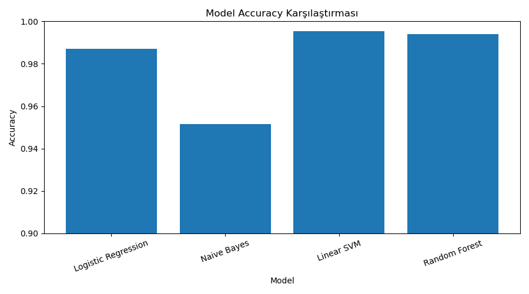
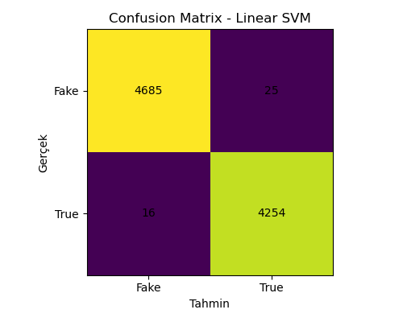

# Fake News Detection System

Makine öğrenmesi modelleri kullanılarak geliştirilmiş gerçek ve sahte haber tespit sistemi.

## Proje Hakkında

Bu projede haber metinlerinin gerçek mi yoksa sahte mi olduğunu tahmin eden bir sistem geliştirilmiştir.

Projede farklı makine öğrenmesi modelleri karşılaştırılmıştır:

- Logistic Regression
- Naive Bayes
- Linear SVM
- Random Forest

Metin verileri TF-IDF yöntemi ile sayısallaştırılmıştır.

En iyi performansı veren model seçilerek Gradio tabanlı bir demo sistemi geliştirilmiştir.

---

## Kullanılan Teknolojiler

- Python
- Scikit-learn
- TF-IDF
- Gradio
- Pandas
- Matplotlib

---

## Veri Seti

Kullanılan veri seti:

- Fake.csv
- True.csv

Veri seti gerçek ve sahte haberlerden oluşmaktadır.

---

## Model Sonuçları

En iyi model yaklaşık %98 doğruluk elde etmiştir.

### Kullanılan metrikler:

- Accuracy
- Precision
- Recall
- F1 Score

---

## Görseller

### Model Accuracy Karşılaştırması



### Confusion Matrix



---

## Projeyi Çalıştırma

### Gereksinimleri yükle

```bash
pip install -r requirements.txt
```

### Modeli eğit

```bash
python train_models.py
```

### Demo uygulamasını çalıştır

```bash
python app.py
```

---

## Demo

Kullanıcı haber metni girerek sistemin tahminini görebilir.

Örnek çıktı:

- 🟥 Sahte Haber
  Researchers at MIT developed a new artificial intelligence system for medical diagnosis.
- 🟩 Gerçek Haber
  WASHINGTON (Reuters) - The U.S. Senate voted on Thursday to approve a new spending bill after weeks of negotiations between lawmakers, according to congressional officials.

---

## Proje Sahibi

Yusuf Atakan ÖZMEN
